# FishyFlappy

## Descripción general y propósito del juego

Fishy es un juego diseñado en Android Studio para concienciar a la gente del peligro
que tiene tirar residuos plásticos al mar mediante el no reciclaje. A continuación se
detallará como es la aplicación y transcurso que siguió.

## Prototipo de la aplicación

El [prototipo de la aplicación sería](https://www.figma.com/proto/jwDlWC1p46czR1ZfwXxDD1/Fishy-Flappy?node-id=2%3A2&scaling=min-zoom&page-id=0%3A1&starting-point-node-id=2%3A2) algo simple,
pues cuenta con una splash screen, la cual en el producto final estará animada con
Adobe After Effects, un menú en el cual se puede tanto jugar, como valorar en la Play Store,
como poder salir del juego fácilmente.

Una vez en el juego, vemos la puntuación, nuestro personaje y los obstáculos por esquivar.
También vemos el botón de pausa que al clickarlo nos lleva al menú de pausa, el cual cuenta
con diversas opciones, como volver al juego, reiniciar el juego y poder ver la configuración,
la cual cuenta con control de volumen de la música y de efectos de sonido.

Una vez morimos, se nos muestra una escena de Game Over, como motas de petróleo
apareciendo por pantalla, dando a entender que el pez murió por la contaminación y seguidamente
un menú en el que podemos empezar una nueva partida, o volver al menú.

También, en el prototipo de figma se puede ver otra escena del juego y es que queremos
en un inicio probar a hacer el estilo de "Flappy Bird" para poder controlar a la perfección
el uso de colliders y división de sprites, ya que no estamos en un motor de videojuegos,
por lo que nos dificulta hacerlo de un modo más sencillo.

Cabe decir que todos los sprites utilizados fueron hechos a mano por nuestro equipo.

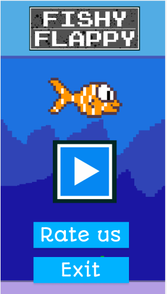

## Paso del prototipo a la aplicación

Una vez que el prototipo estaba terminado, se pasó a la aplicación, para ello, se creó
el proyecto utilizando la librería [LibGDX](https://libgdx.com/), la cual nos permite crear juegos en Java.

Gracias a esto y a cierta ayuda de algunos videotutoriales de Youtube, se pudo simular
el popular juego "Flappy Bird", y utilizarla como base para poder aprender cómo utilizar
esta nueva librería.

En el vídeo a continuación se puede ver este tipo de simulación para aprender a utilizar
[valores vectoriales de posición de objetos](./core/src/com/erdarkniel/fishyflappy/sprites/Fish.java), [cámaras](./core/src/com/erdarkniel/fishyflappy/states/MenuState.java), [colliders mediante rectángulos invisibles](./core/src/com/erdarkniel/fishyflappy/sprites/Tube.java), [divisiones de imagen](./core/src/com/erdarkniel/fishyflappy/sprites/Fish.java), etc.

https://user-images.githubusercontent.com/105220864/211762644-49f031ec-6a51-4837-87f5-b8d9e252d557.mp4

Llegados aquí, hemos de cambiar los sprites que estabamos utilizando, por los del juego propio, y aquí llegamos a un problema,
ya que los sprites utilizados y los realizados a mano no coincidían en tamaños, por lo que los sprites nuevos se veían gigantes.
Así que tuvimos que poner crear Pixmap para poder variar a nuestro gusto el tamaño de los sprites, y así poder utilizarlos. Esto
lo podemos encontrar en el archivo [Fish](./core/src/com/erdarkniel/fishyflappy/sprites/Fish.java).

## Progreso anterior

Actualmente el proyecto se encuentra como las imágenes mostradas a continuación.

Actualmente contamos con un [SplashScreen](./core/src/com/erdarkniel/fishyflappy/states/SplashScreen.java) sencillo debido a que para poder reproducir un vídeo dentro de la aplicación es necesario importar una librería la cual nos
da errores debido a los métodos de los cuales extiende (State), y al intentar reproducir un .gif la calidad de las imágenes disminuye y solo se muestra un solo frame,
por lo que la solución encontrada fue dividir la animación en una secuencia de pngs, sin embargo, a la hora de redimensionar estás imágenes con pixmaps, las librerías
no nos permiten su perfecta colocación mediante coordenadas, por lo que decidimos hacer un Splash Screen provisional mientras solucionamos el problema.

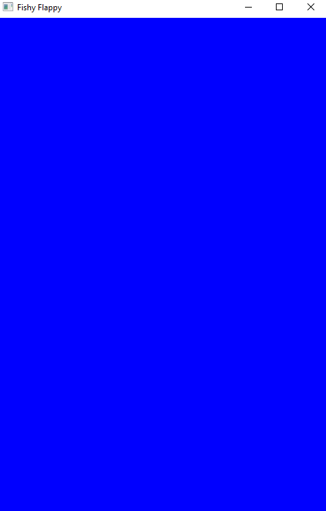

En cuanto al [Menú principal](./core/src/com/erdarkniel/fishyflappy/states/MenuState.java) de la aplicación encontramos un error el cual era de que no podemos trabajar
con coordenadas debido a que estas se guían por el tamaño de píxeles del dispositivo, por lo que la colocación de los botones era distinto en cada dispositivo que se jugara.
Para solucionarlo, hemos implementado formulas matemáticas basándonos en las coordenadas originales de un dispositivo, de esta forma, para todos los dispositivos tenemos
los botones perfectamente posicionados (capturas de la solución en la parte inferior a esta explicación).

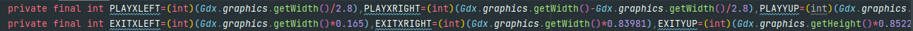 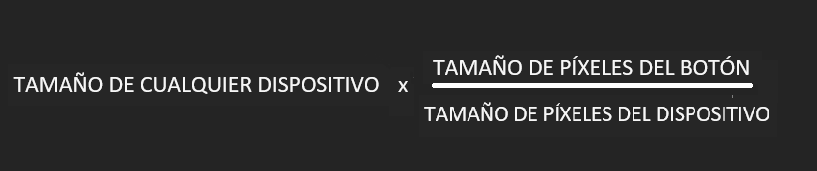

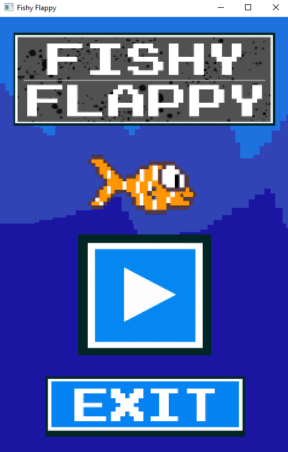

En cuanto al [PlayState](./core/src/com/erdarkniel/fishyflappy/states/PlayState.java), los cambios implementados han sido poder introducir un sistema de puntuación el cual sume un punto al score cada vez que se pasen las botellas.
Sin embargo esto es un modelo provisional, debido a que estamos realizando cambios para que las botellas esten flotando a lo largo de la pantalla y que, claramente sean más pequeñas,
sin embargo, estamos teniendo problemas a la hora de modificar las físicas de las mismas (gravedad y velocidad), ya que cuanto más tiempo de partida pasa, van adquiriendo más velocidad
y acaban saliendo las botellas de la pantalla, sin embargo, son cambios los cuales estamos trabajando en ello. Otro problema que también nos encontramos es a la hora de
implementar la base de datos para poder guardar el 'highscore' del dispositivo, puesto que el método execute() no ejecuta de manera correcta el comando SQL que mandamos,
por lo que de momento no está implementado en su totalidad para que el juego aún así pueda ser jugable. Sin embargo, recalco, son errores en los cuales estamos trabajando y
avanzando para hacer de la aplicación un juego completo.

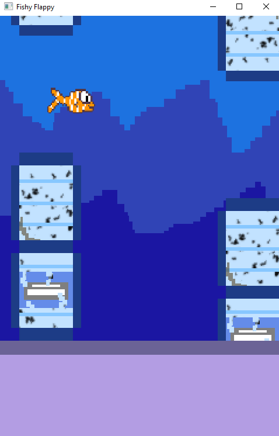

Hemos agregado una pantalla de [Game Over](./core/src/com/erdarkniel/fishyflappy/states/GameOver.java) para cuando el jugador colisione tanto con el suelo como con una botella.
De momento hemos implementado que el jugador pueda ver la puntuación que ha logrado, y un botón para volver al menú principal para poder volver a jugar. En este State
de la aplicación también se vería el 'highscore' almacenado en la base de datos, pero, como hemos mencionado antes, tenemos problemas a la hora de introducirlo, por lo que,
repito, para que el juego pueda ser funcional y semicompleto, de momento no es visible a la hora de jugarlo.

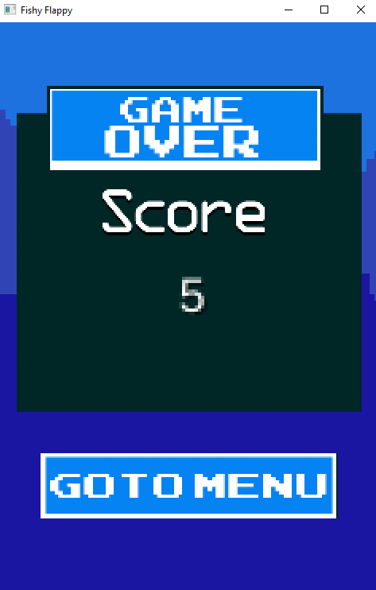

En cuanto al logo de la aplicación hemos hecho que sea adaptativo y que esté divido en varias capas, es decir, tiene distintas resoluciones para los distintos dispositivos,
y el sistema de capas permite darle profundidad, puesto que el pez y el fondo están dividos en 2 XML distinto, esto se puede apreciar al mover la aplicación en el menú
principal del móvil y dejando caer la aplicación, como el pez se mueve al centro del logo con más delay que el fondo.

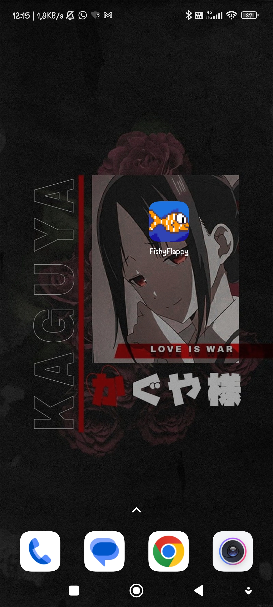

## Progreso actual

Los cambios pertinentes realizados en los [Sprites](./core/src/com/erdarkniel/fishyflappy/sprites) han sido:

En la clase [Bottle](./core/src/com/erdarkniel/fishyflappy/sprites/Bottle.java) se ha minimizado el tamaño de las botellas debido a que, como veremos posteriormente, se ha cambiado la forma
de juegos de los sprints anteriores, por lo que ahora tiene las medidas que veremos en las capturas de a continuación. Otro de los cambios que se ha realizado han sido agregar valores de
gravedad a estos objetos. De esta manera la botella podrá subir y bajar por toda la pantalla. La forma en la que trabaja la gravedad lo podemos ver en el update de la misma clase, la cual actúa
sobre la velocidad, la cual es la indicada de cambiar la posición.

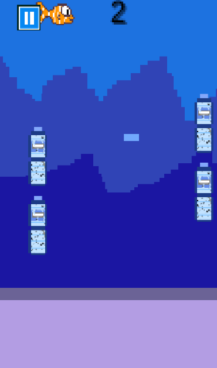

Se ha añadido una nueva clase llamada [Cap](./core/src/com/erdarkniel/fishyflappy/sprites/Cap.java), esta tiene la misma función que las botellas. Por lo que el código es el mismo,
el único cambio que existe a parte de la textura, es que de este solo es generado un objeto, como podemos observar en la imagen anterior.

En cuanto a los [States](./core/src/com/erdarkniel/fishyflappy/states) los cambios han sido mayores, ya que el cambio más significativo ha sido cambiar todo el sistema de juego de manera que, ya no
son botellas estáticas qye hay que pasar entre ellas estilo "Flappy Bird" sino que ahora estas botellas tienen movimiento a lo largo de toda la pantalla y por la cual tienes varios entrantes por donde
esquivarlas, sin embargo, también tendrás que esquivar los tapones de botella que flotan a lo largo de la pantalla, siendo una dificultad añadida.

En el [Game Over](./core/src/com/erdarkniel/fishyflappy/states/GameOver.java) se ha añadido una librería propia de LibGDX llamada "Preferences" la cual nos permite guardar variables u objetos
sin que estos se pierdan aunque se cierre la aplicación. Esto nos ayuda bastante ya que así no es necesario crear una base de datos para tener solo el valor del highscore y actualizarlo,
sino que con esta librería, se nos hace más sencillo. Este valor se muestra en pantalla a modo de record global del dispositivo y, si es superado, a su lado aparecerá una imagen de "New best" la
cual indica que el record ha sido batido. Otro cambio que se ha realizado es la implementación del botón "PLay Again" para no tener que pasar por el menú si queremos
volver a jugar.

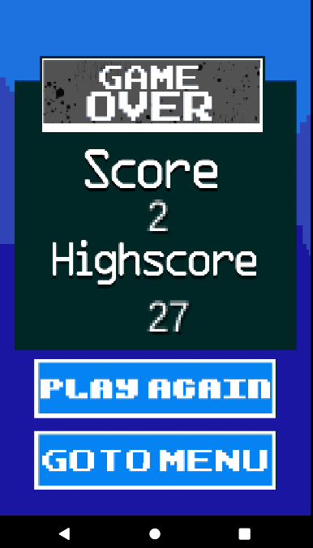

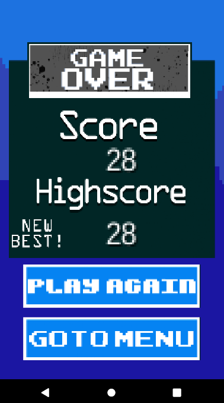

En cuanto al [PlayState](./core/src/com/erdarkniel/fishyflappy/states/PlayState.java) ha habido cambios muy significativos. Comenzaremos hablando sobre los cambios realizados sobre lo que ya había, y posteriormente
hablaremos sobre las nuevas funcionalidades que hemos implementado. Sobre lo que teníamos, se ha cambiado el sistema de puntuaciones, ya que, anteriormente se realizó con unas hitboxs invisibles las cuales a la hora
de chocar con ellas se sumaban los puntos, sin embargo, nos encontramos con el problema de que había veces que se duplicaba la puntuación por lo que no era exacta, así tras analizarlo,
dimos con que la mejor forma de sumar los puntos sería mediante el tiempo, ya que al tener siempre la misma distancia las botellas, es muy sencillo el poder hacer la suma.
Otro cambio significativo ha sido implementar el botón de pausa, el cual pausa el juego (que actuaría como hilo) y nos mostraría un menú en el cual podemos tanto volver a nuestra partida actual, como comenzar una nueva. Esto lo
veremos en las capturas adyacentes.
El cambio más brusco que podemos observar ha sido el cambio en la modalidad de juego, puesto que, como explique brevemente antes, ya no son botellas estáticas, sino móviles junto a sus tapones.
Cabe destacar que en el [PlayState](./core/src/com/erdarkniel/fishyflappy/states/PlayState.java) se crean y se cambia su comportamiento. En el caso de las botellas, se crean 4 y en el de los tampones 5, para mayor dificulta y posiciones
más randomizadas. El comportamiento de las mismas es controlado por sus gravedades, siendo estas cambiadas de valores positivos a negativos y viceversa en el update, para que, llegados a cierta altura, estas cambien. Podemos observar
que los valores de cada una de las gravedades es distinto, esto fue realizado así para que el punto de colisión de las botellas no sea siempre en el centro, de esta manera, se le otorga mayor dificultad al juego.
Otro cambio también fue que ya no puedes salir del mapa por la parte superior, simplemente se otorga un pequeño margen de salto por si se requiere hacer en el límite de la pantalla, y aprovechamos esto para comentar que, cuando el pez muere
el móvil solo vibrará por las botellas o tapones al tocarlos, ya que es por la influencia de la causa humana, si, por el contrario el pez muere por choque contra el suelo o salida para el exterior, esto sería considerado como causa de muerte natural
por lo que el móvil no vibrará (esta explicación es obviamente a modo conceptual, para que se entienda la idea de por qué decidimos que solo vibre al tocar el plástico).

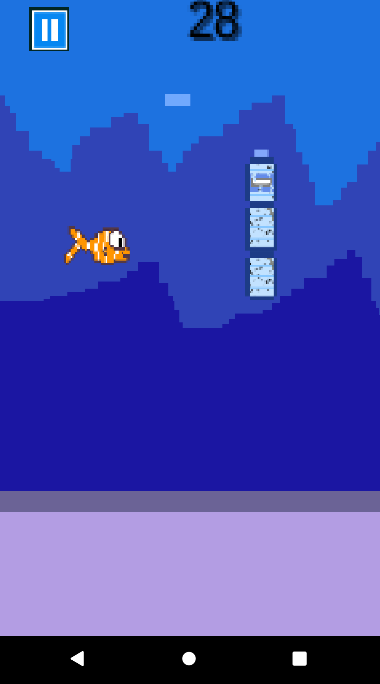

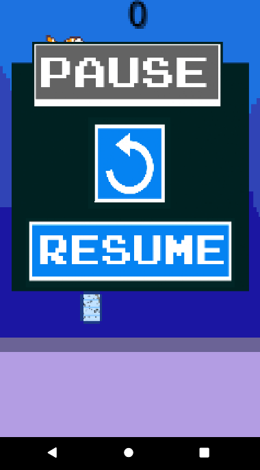

En cuanto a las texturas, se puede ver que algunas fueron reemplazadas ya que, los menús se parecían mucho a los botones entonces se decidieron cambiar. A su vez, también se hizo una prueba para evaluar el diseño de la aplicación (sprites creados todos por nosotros)
y nos dió el siguiente resultado.