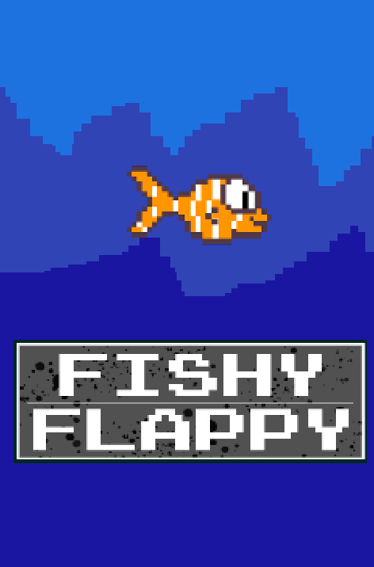
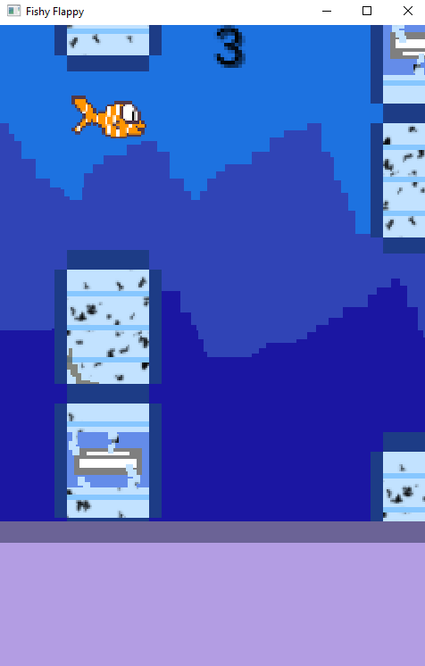

# FishyFlappy

## Descripción general y propósito del juego

Fishy es un juego diseñado en Android Studio para concienciar a la gente del peligro
que tiene tirar residuos plásticos al mar mediante el no reciclaje. A continuación se
detallará como es la aplicación y transcurso que siguió.

## Prototipo de la aplicación

El [prototipo de la aplicación sería](https://www.figma.com/proto/jwDlWC1p46czR1ZfwXxDD1/Fishy-Flappy?node-id=2%3A2&scaling=min-zoom&page-id=0%3A1&starting-point-node-id=2%3A2) algo simple,
pues cuenta con una splash screen, la cual en el producto final estará animada con
Adobe After Effects, un menú en el cual se puede tanto jugar, como valorar en la Play Store,
como poder salir del juego fácilmente.

Una vez en el juego, vemos la puntuación, nuestro personaje y los obstáculos por esquivar.
También vemos el botón de pausa que al clickarlo nos lleva al menú de pausa, el cual cuenta
con diversas opciones, como volver al juego, reiniciar el juego y poder ver la configuración,
la cual cuenta con control de volumen de la música y de efectos de sonido.

Una vez morimos, se nos muestra una escena de Game Over, como motas de petróleo
apareciendo por pantalla, dando a entender que el pez murió por la contaminación y seguidamente
un menú en el que podemos empezar una nueva partida, o volver al menú.

También, en el prototipo de figma se puede ver otra escena del juego y es que queremos
en un inicio probar a hacer el estilo de "Flappy Bird" para poder controlar a la perfección
el uso de colliders y división de sprites, ya que no estamos en un motor de videojuegos,
por lo que nos dificulta hacerlo de un modo más sencillo.

Cabe decir que todos los sprites utilizados fueron hechos a mano por nuestro equipo.

## Paso del prototipo a la aplicación

Una vez que el prototipo estaba terminado, se pasó a la aplicación, para ello, se creó
el proyecto utilizando la librería [LibGDX](https://libgdx.com/), la cual nos permite crear juegos en Java.

Gracias a esto y a cierta ayuda de algunos videotutoriales de Youtube, se pudo simular
el popular juego "Flappy Bird", y utilizarla como base para poder aprender cómo utilizar
esta nueva librería.

En el vídeo a continuación se puede ver este tipo de simulación para aprender a utilizar
[valores vectoriales de posición de objetos](./core/src/com/erdarkniel/fishyflappy/sprites/Fish.java), [cámaras](./core/src/com/erdarkniel/fishyflappy/states/MenuState.java), [colliders mediante rectángulos invisibles](./core/src/com/erdarkniel/fishyflappy/sprites/Tube.java), [divisiones de imagen](./core/src/com/erdarkniel/fishyflappy/sprites/Fish.java), etc.

https://user-images.githubusercontent.com/105220864/211762644-49f031ec-6a51-4837-87f5-b8d9e252d557.mp4

Llegados aquí, hemos de cambiar los sprites que estabamos utilizando, por los del juego propio, y aquí llegamos a un problema,
ya que los sprites utilizados y los realizados a mano no coincidían en tamaños, por lo que los sprites nuevos se veían gigantes.
Así que tuvimos que poner crear Pixmap para poder variar a nuestro gusto el tamaño de los sprites, y así poder utilizarlos. Esto
lo podemos encontrar en el archivo [Fish](./core/src/com/erdarkniel/fishyflappy/sprites/Fish.java).

## Progreso anterior

Actualmente el proyecto se encuentra como las imágenes mostradas a continuación.

Actualmente contamos con un [SplashScreen](./core/src/com/erdarkniel/fishyflappy/states/SplashScreen.java) sencillo debido a que para poder reproducir un vídeo dentro de la aplicación es necesario importar una librería la cual nos
da errores debido a los métodos de los cuales extiende (State), y al intentar reproducir un .gif la calidad de las imágenes disminuye y solo se muestra un solo frame,
por lo que la solución encontrada fue dividir la animación en una secuencia de pngs, sin embargo, a la hora de redimensionar estás imágenes con pixmaps, las librerías
no nos permiten su perfecta colocación mediante coordenadas, por lo que decidimos hacer un Splash Screen provisional mientras solucionamos el problema.

En cuanto al [Menú principal](./core/src/com/erdarkniel/fishyflappy/states/MenuState.java) de la aplicación encontramos un error el cual era de que no podemos trabajar
con coordenadas debido a que estas se guían por el tamaño de píxeles del dispositivo, por lo que la colocación de los botones era distinto en cada dispositivo que se jugara.
Para solucionarlo, hemos implementado formulas matemáticas basándonos en las coordenadas originales de un dispositivo, de esta forma, para todos los dispositivos tenemos
los botones perfectamente posicionados (capturas de la solución en la parte inferior a esta explicación).

 

En cuanto al [PlayState](./core/src/com/erdarkniel/fishyflappy/states/PlayState.java), los cambios implementados han sido poder introducir un sistema de puntuación el cual sume un punto al score cada vez que se pasen las botellas.
Sin embargo esto es un modelo provisional, debido a que estamos realizando cambios para que las botellas esten flotando a lo largo de la pantalla y que, claramente sean más pequeñas,
sin embargo, estamos teniendo problemas a la hora de modificar las físicas de las mismas (gravedad y velocidad), ya que cuanto más tiempo de partida pasa, van adquiriendo más velocidad
y acaban saliendo las botellas de la pantalla, sin embargo, son cambios los cuales estamos trabajando en ello. Otro problema que también nos encontramos es a la hora de
implementar la base de datos para poder guardar el 'highscore' del dispositivo, puesto que el método execute() no ejecuta de manera correcta el comando SQL que mandamos,
por lo que de momento no está implementado en su totalidad para que el juego aún así pueda ser jugable. Sin embargo, recalco, son errores en los cuales estamos trabajando y
avanzando para hacer de la aplicación un juego completo.

Hemos agregado una pantalla de [Game Over](./core/src/com/erdarkniel/fishyflappy/states/GameOver.java) para cuando el jugador colisione tanto con el suelo como con una botella.
De momento hemos implementado que el jugador pueda ver la puntuación que ha logrado, y un botón para volver al menú principal para poder volver a jugar. En este State
de la aplicación también se vería el 'highscore' almacenado en la base de datos, pero, como hemos mencionado antes, tenemos problemas a la hora de introducirlo, por lo que,
repito, para que el juego pueda ser funcional y semicompleto, de momento no es visible a la hora de jugarlo.

En cuanto al logo de la aplicación hemos hecho que sea adaptativo y que esté divido en varias capas, es decir, tiene distintas resoluciones para los distintos dispositivos,
y el sistema de capas permite darle profundidad, puesto que el pez y el fondo están dividos en 2 XML distinto, esto se puede apreciar al mover la aplicación en el menú
principal del móvil y dejando caer la aplicación, como el pez se mueve al centro del logo con más delay que el fondo.

